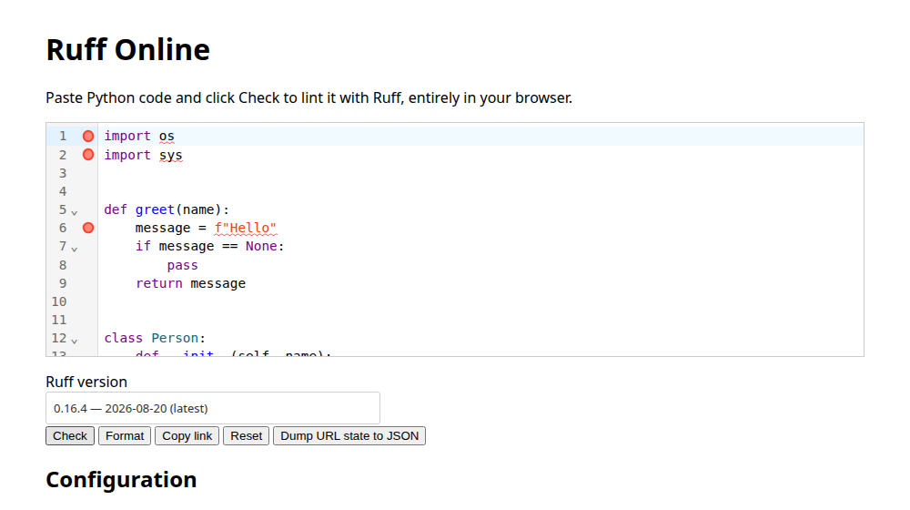

# Ruff Online

A browser-based playground for [Ruff](https://docs.astral.sh/ruff/), the
Python linter/formatter — entirely client-side via Ruff's official
WebAssembly build (`@astral-sh/ruff-wasm-web`), no backend. Nothing you paste
into the editor ever leaves your browser.

**Live:** https://lenormju.github.io/ruff-online/



## Features

- **Multi-version support** — pick any supported Ruff release from a
  searchable, browsable picker; new releases are ingested automatically
  (see [Version ingestion](#version-ingestion) below).
- **Check & Format** — lint with inline squiggly diagnostics (click-to-jump,
  hover for the message) and a side-by-side diff for `ruff format`, with a
  one-click Apply.
- **Two independent config facets, always kept in sync**:
  - **Code** — a `pyproject.toml`-style base config plus CLI-style override
    flags (`--select`, `--config "<path>=<value>"`, …), merged exactly like
    real Ruff layers a checked-in config file with ad-hoc flags.
  - **Visual** — point-and-click controls for every `RuffOptions` field:
    general/formatting settings, rule selection (with category/rule
    tri-state toggles and full `select`/`ignore`/`extend-select`
    reconciliation, including `ALL`), and per-plugin fine-tuning for all 27
    plugin namespaces.
- **Shareable links** — the full state (code, config, selected version) is
  encoded into the URL hash, so a "Copy link" click produces a link that
  reproduces the exact same session for anyone who opens it.

## Version ingestion

`public/supported-versions.json` is refreshed daily by
[`.github/workflows/ingest-versions.yml`](.github/workflows/ingest-versions.yml),
which checks for new stable Ruff releases, smoke-tests each candidate
against the real `@astral-sh/ruff-wasm-web` package, and only commits
versions that pass. As of this writing the oldest ingested version is
`0.13.2`; the code itself supports back to `0.11.1` (versions older than
`0.13.2` would show a small warning, since Ruff's WebAssembly build only
started reporting UTF-16 diagnostic positions from that release onward),
but the version list is only ever appended to going forward by the daily
ingestion workflow, not backfilled.

## Development

```sh
pnpm install
pnpm dev      # local dev server
pnpm test     # vitest
pnpm build    # tsc -b && vite build
```

Deployment to GitHub Pages happens automatically on every push to `main`
via [`.github/workflows/deploy.yml`](.github/workflows/deploy.yml).

## License

[MIT](LICENSE). Ruff and `@astral-sh/ruff-wasm-web` are themselves
MIT-licensed by [Astral](https://astral.sh/) — this project loads the wasm
build from a CDN rather than vendoring it, but full credit for the linter/
formatter itself goes to the Ruff project.
